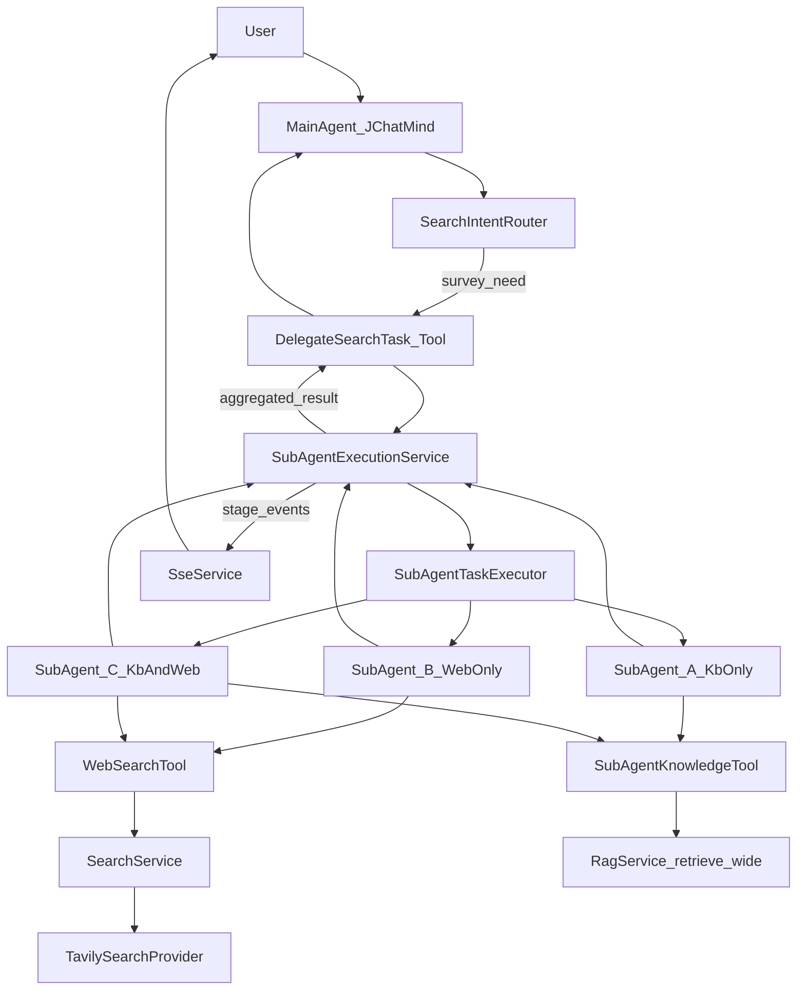
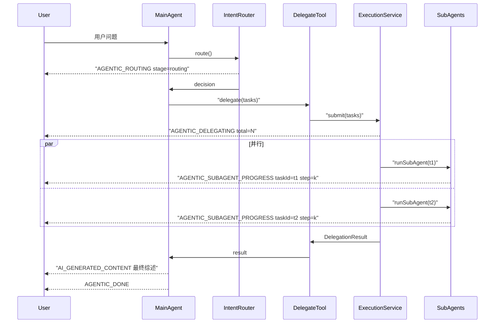

# Agentic Search 落地方案 Plan

> 本文是 [AGENTIC_SEARCH_HANDOFF.md](AGENTIC_SEARCH_HANDOFF.md) 的落地执行版，综合交接文档 + 已确认的两项关键决策（拓扑=主 Agent 可派发 1~N 个并行子 Agent；SERP Provider 首选 Tavily）细化而成。

- **Name**: agentic-search-delegation
- **Overview**: 在 JChatMind 现有 ReAct 单 Agent 架构上，新增“主 Agent 委派 N 个并行子 Agent”的 Agentic Search 能力，支持一次委派内同时跑 KB 宽召回与 Tavily 外部搜索，子 Agent 只回传结构化执行摘要 + 引用，由主 Agent 成文。

## Todos（分 5 个 PR，渐进合入）

- [ ] **PR1：冻结契约 + 骨架**
  新增 DTO（`SubTaskSpec`/`DelegationResult`/`SubTaskResult`/`SubTaskFailure`/`Citation`）+ 错误码枚举；在 `SseMessage.Type` 补全 `AGENTIC_*` 枚举值与 payload 字段；在 `application.yaml` 新增 `jchatmind.agentic-search.*` 与 `jchatmind.search.tavily.*` 配置段（还不做实现，只占位）；补一个 JSON schema 的单元测试确保 Spring AI 能正确描出 `delegateSearchTask` 的入参描述。
- [ ] **PR2：子 Agent Runtime 与执行服务**
  `JChatMind` 新增 `role`/`persistMessages`/`emitSse` 构造参数（默认不改变主 Agent 行为）；`JChatMindFactory` 抽出 `buildToolCallbacksFromTools` + `resolveChatClient`；新增 `SubAgentRuntimeFactory` / `SubAgentToolsetPolicy` / `SubAgentExecutionService` / `SubAgentTaskExecutorConfig`；新增 `SearchDelegationTool`（先只通 KB-only 路径、`WebSearchTool` 用 Noop 代替）；写串行 + 并行 + 超时 + 聚合的单元测试。
- [ ] **PR3：KB 宽召回专用工具**
  新增 `SubAgentKnowledgeTool.knowledgeWideQuery(kbId, query, topK)` 返回结构化 JSON（包含 `chunkId/docId/content/score/rank`）；`RagHybridProperties` 增 `maxTopN` 上限；`KnowledgeTools` 补可选 `topN` 参数（向后兼容）；补子 Agent 仅 KB 模式的集成测试（基于 PR2 平台）。
- [ ] **PR4：自建 SearchService + Tavily Provider**
  新增 `SearchService`/`SearchProvider`/`SearchRequest`/`SearchResult`/`SearchHit`；实现 `TavilySearchProvider`（WebClient + 重试 + 字段标准化）+ `SearchServiceImpl`（Caffeine 缓存 + 失败降级）；将 `WebSearchTool` 从 Noop 切换为真实实现；`SubAgentExecutionService` 加 `web_to_kb` 回退逻辑；用 WireMock 覆盖 Tavily 正常 / 超时 / 429 / 字段缺失。
- [ ] **PR5：意图路由与轻量 SSE**
  新增 `SearchIntentRouter`（独立 LLM 小调用）+ `SearchIntentDecision`；在 agent 入口（`SseController` 或 `AgentController` 触发路径）接入路由 + 动态拼接主 Agent `systemPrompt`；`SubAgentExecutionService` 按阶段发 `AGENTIC_ROUTING`/`DELEGATING`/`SUBAGENT_PROGRESS`/`FALLBACK`/`DONE`；回归测试短问答不被误路由；补端到端集成测试（1 任务 KB-only + 1 任务 Web-only + 1 任务双开）。

---

## 1. 目标与边界

- 新增能力：主 Agent 识别“综述/广搜/跨源分析”型问题后，通过固定工具 `delegateSearchTask` 一次派发 1~N 个子任务（每个子任务独立 `allowKbSearch`/`allowWebSearch`），子 Agent 并行执行，返回结构化结果供主 Agent 综合成文。
- 第一版边界（按交接文档）：
  - 子 Agent 禁止再次委派（无递归）。
  - 外部搜索只接 Tavily 一家，封装在 `SearchProvider` 背后。
  - 不做网页正文抓取、不做资料入库。
  - 前端只展示轻量状态，不展示子 Agent 思维链。

## 2. 目标架构



核心不变量：
- 子 Agent 复用 [src/main/java/com/kama/jchatmind/agent/JChatMind.java](src/main/java/com/kama/jchatmind/agent/JChatMind.java) 的 think/execute 循环实现，只是工具白名单、`MAX_STEPS`、memory、systemPrompt 不同，**不抽基类、不改主循环**。
- 主 Agent 的 ReAct 逻辑、DB 持久化、SSE 通道一律保持现状，`delegateSearchTask` 只是一个普通的 FIXED Tool。

## 3. `delegateSearchTask` 契约（先冻结）

工具暴露给主 Agent 的签名（参数类型用 Java record，Spring AI 自动生成 JSON schema）：

```java
@Tool(name = "delegateSearchTask", description = "...")
public DelegationResult delegate(List<SubTaskSpec> tasks, GlobalPolicy policy);
```

### 入参（单个 SubTaskSpec）

```json
{
  "taskId": "t1",
  "taskDescription": "检索 2025 年 SpaceX 每月发射次数与重大任务",
  "kbId": "kb_space_news",
  "scope": {
    "timeRange": "2025",
    "region": "US",
    "mustCover": ["每月发射次数", "关键任务", "集中发射月份"]
  },
  "searchPolicy": {
    "allowKbSearch": true,
    "allowWebSearch": true,
    "maxSubSteps": 6,
    "timeoutSeconds": 45
  }
}
```

### 全局 policy

```json
{
  "maxParallel": 4,
  "globalTimeoutSeconds": 60
}
```

### 出参（DelegationResult）

```json
{
  "results": [
    {
      "taskId": "t1",
      "status": "OK",
      "summary": "2025 年 SpaceX 发射整体呈前低后高态势……",
      "keyFindings": [
        {"title": "发射高峰", "detail": "10-11 月明显高于年均", "citations": ["web:1", "kb:2"]}
      ],
      "citations": [
        {"id": "web:1", "title": "...", "url": "...", "snippet": "...", "sourceType": "web", "publishedAt": "2025-11-03"},
        {"id": "kb:2", "title": "...", "docId": "d_123", "chunkId": "c_45", "snippet": "...", "sourceType": "kb"}
      ],
      "stats": {"toolCalls": 5, "kbQueries": 2, "webQueries": 3, "elapsedMs": 18450}
    }
  ],
  "failures": [
    {"taskId": "t2", "errorCode": "SEARCH_DELEGATION_TIMEOUT", "message": "..."}
  ],
  "aggregate": {"elapsedMs": 19200, "totalTokenUsage": {"prompt": 12500, "completion": 3400}}
}
```

### 错误码（全部用于 `failures[].errorCode`）

- `SEARCH_DELEGATION_TIMEOUT`：子 Agent 超过 `timeoutSeconds`
- `SEARCH_DELEGATION_NO_EVIDENCE`：任何来源都 0 结果
- `SEARCH_DELEGATION_TOOL_LIMIT`：达到 `maxSubSteps`
- `SEARCH_DELEGATION_PROVIDER_ERROR`：Tavily/RAG 异常且无降级路径
- `SEARCH_DELEGATION_INVALID_INPUT`：入参校验失败
- 主 Agent **不能**把 failures 当错误异常处理，应在综述里降级说明“某维度材料不足”。

## 4. 模块与文件清单

### 4.1 新增（按包结构）

- `agent/tools/SearchDelegationTool.java` — 主 Agent 工具，`ToolType.FIXED`，调 `SubAgentExecutionService`。
- `agent/tools/SubAgentKnowledgeTool.java` — 子 Agent 专属 KB 宽召回工具，`ToolType.FIXED`，但**只在子 Agent 工具集里**（主 Agent 不见）。方法 `knowledgeWideQuery(kbId, query, topK)`，返回结构化 JSON（含 `chunkId`/`docId`/`content`/`score`），不拼字符串。
- `agent/tools/WebSearchTool.java` — 子 Agent 专属外部搜索工具，方法 `webSearch(query, count, timeRange, domainFilter)`，底层调 `SearchService`，返回结构化 `List<SearchHit>` JSON。
- `agent/search/SubAgentExecutionService.java` — 接收 `List<SubTaskSpec>`，按 policy 拆成并行任务、提交到 `SubAgentTaskExecutor`、聚合、发 SSE、处理超时。
- `agent/search/SubAgentRuntimeFactory.java` — 构造一个“阉割版 JChatMind”：独立 subSessionId、独立 memory、指定工具白名单、`MAX_STEPS=maxSubSteps`。内部复用 [src/main/java/com/kama/jchatmind/agent/JChatMindFactory.java](src/main/java/com/kama/jchatmind/agent/JChatMindFactory.java) 的装配片段（ChatClient、ToolCallback 构造），但**不走 DB 加载 Agent、不走 DB 加载 memory**。
- `agent/search/SubAgentToolsetPolicy.java` — 纯规则函数：根据 `SubTaskSpec.searchPolicy` 决定装配哪些工具（KB-only / Web-only / 两者 / 必选 `TerminateTool`）。
- `agent/search/SearchIntentRouter.java` + `SearchIntentDecision.java` — 单独的 LLM 小调用，判定 `{useAgenticSearch: bool, reason: survey|time_series|multi_source|comparison|none, needClarification: bool}`。集成点见 §6。
- `agent/search/model/SubTaskSpec.java` / `DelegationResult.java` / `SubTaskResult.java` / `SubTaskFailure.java` / `Citation.java` — 契约 DTO，放 record。
- `search/SearchService.java` + `impl/SearchServiceImpl.java` — 统一入口，负责缓存（Caffeine，短 TTL 10 分钟）、重试、规范化、失败兜底。
- `search/SearchProvider.java` + `impl/TavilySearchProvider.java` — Tavily 适配器。
- `search/model/SearchRequest.java` / `SearchResult.java` / `SearchHit.java` — 与 provider 解耦的标准化结构。
- `config/TavilyProperties.java` — `@ConfigurationProperties(prefix="jchatmind.search.tavily")`。
- `config/AgenticSearchProperties.java` — 主配置项（见 §9）。
- `config/AgentSubTaskExecutorConfig.java` — 专用 `ThreadPoolTaskExecutor`（core=8/max=16/queue=64）+ `Semaphore` 限每请求并发。
- 测试：`agent/search/SubAgentExecutionServiceTest.java`、`search/TavilySearchProviderTest.java`、`agent/search/SearchIntentRouterTest.java`。

### 4.2 改造

- [src/main/java/com/kama/jchatmind/agent/tools/KnowledgeTools.java](src/main/java/com/kama/jchatmind/agent/tools/KnowledgeTools.java) — **仅补一个可选 `topN` 参数签名（默认走 `finalTopN`），保持向后兼容**。子 Agent 不复用它，主 Agent 普通场景仍用它。
- [src/main/java/com/kama/jchatmind/service/impl/RagServiceImpl.java](src/main/java/com/kama/jchatmind/service/impl/RagServiceImpl.java) — **不改签名**，`retrieve(kbId, query, topN)` 已经支持任意 topN，子 Agent 的宽召回直接传大 topN（如 30）即可。仅在 `RagHybridProperties` 加一个 `maxTopN` 上限保护（默认 100）。
- [src/main/java/com/kama/jchatmind/agent/JChatMindFactory.java](src/main/java/com/kama/jchatmind/agent/JChatMindFactory.java) — 抽出两个 package-private 方法供 `SubAgentRuntimeFactory` 复用：`buildToolCallbacksFromTools(List<Tool>)`、`resolveChatClient(String model)`。**不改 `create()` 主入口。**
- [src/main/java/com/kama/jchatmind/agent/JChatMind.java](src/main/java/com/kama/jchatmind/agent/JChatMind.java) — 新增可选构造参数 `AgentRole role`（默认 MAIN）+ `boolean persistMessages`（默认 true）+ `boolean emitSse`（默认 true）。子 Agent 用 `role=SUB` 且两个 flag 关闭。`saveMessage()` / `refreshPendingMessages()` 内部据此 no-op。**think/execute/step/run 逻辑零改动。**
- [src/main/java/com/kama/jchatmind/message/SseMessage.java](src/main/java/com/kama/jchatmind/message/SseMessage.java) — `Type` 枚举追加：`AGENTIC_ROUTING`、`AGENTIC_DELEGATING`、`AGENTIC_SUBAGENT_PROGRESS`、`AGENTIC_FALLBACK`、`AGENTIC_DONE`；`Payload` 追加字段 `stage`、`step`、`totalSteps`、`toolName`、`taskId`。前端若尚未适配，未知 Type 自动忽略，向后兼容。
- `application.yaml` — 新增 `jchatmind.agentic-search.*`、`jchatmind.search.tavily.*` 配置段（见 §9）。
- 主 Agent 的 `systemPrompt`：在 DB Agent 实体里维护，不需要代码变更；落地时让用户（或初始化脚本）追加一段策略描述，告诉主 LLM 什么时候调 `delegateSearchTask`。

## 5. 子 Agent Runtime 设计要点

子 Agent **不**是新类，**是**一个配置不同的 `JChatMind` 实例。`SubAgentRuntimeFactory.create(SubTaskSpec spec, String parentSessionId)` 的装配流程：

1. `subSessionId = parentSessionId + ":sub:" + spec.taskId + ":" + uuid`（不写 DB，仅内存里给 `MessageWindowChatMemory` 当 key 用）。
2. `memory = []`（全新，不读 `chat_message` 表），仅塞一条 SystemMessage：子 Agent 角色定义 + **严格 JSON 输出 schema**（对应 `SubTaskResult`）。
3. `tools = SubAgentToolsetPolicy.resolve(spec)`：
   - 始终包含：`TerminateTool`、`DirectAnswerTool`（子 Agent 用 DirectAnswer 返回最终 JSON）
   - `allowKbSearch=true` → 加 `SubAgentKnowledgeTool`
   - `allowWebSearch=true` → 加 `WebSearchTool`
   - **永不包含**：`SearchDelegationTool`（防递归）、`FileSystemTools`、`EmailTools`、`DataBaseTools` 等可变副作用工具
4. `MAX_STEPS = spec.searchPolicy.maxSubSteps`（上限由配置 `maxSubStepsCap` 夹住）
5. `chatClient` 默认继承主 Agent 的 model（由 `SubAgentExecutionService` 从当前主 Agent 上下文取），也支持配置覆盖。
6. 子 Agent `run()` 完成后，`SubAgentExecutionService` 从 memory 的最后一条 AssistantMessage 里**强制解析 JSON**：解析失败 → 兜底再发一次“请仅输出 JSON”的修复轮（最多 1 次），仍失败 → 返回 `SEARCH_DELEGATION_PROVIDER_ERROR`。

**为什么不用 `JChatMindV2`**：`V2` 是早期示例，没接 SSE/持久化开关；直接复用 `JChatMind` 加两个 flag 更省事，且保持“唯一 runtime”。

## 6. SearchIntentRouter 的集成方式

交接文档要求“LLM 意图路由”，但位置没定死。落地选择：**单独的轻量 LLM 调用，放在主 Agent `run()` 之前**，而不是让主 LLM 自己判断。理由：

- 主 Agent 的系统提示词保持通用，不被综述策略污染。
- Router 可以用更便宜/更快的模型（如 `deepseek-chat` 非 reasoning），降本。
- 决策可日志化/可评测。

集成点：在 [src/main/java/com/kama/jchatmind/controller/SseController.java](src/main/java/com/kama/jchatmind/controller/SseController.java)（或 agent 入口处，视实际入口）调 `JChatMindFactory.create()` 之前：
- 调 `SearchIntentRouter.route(userInput, conversationTail)` → `SearchIntentDecision`。
- 发 SSE `AGENTIC_ROUTING` 事件。
- 如果 `useAgenticSearch=false`：不改变任何行为，照常走主 Agent。
- 如果 `useAgenticSearch=true`：在主 Agent 的 systemPrompt 尾部**动态拼**一段“本题被判定为综述型，优先使用 `delegateSearchTask`”的提示，再跑主 Agent。

**降级**：Router 本身异常/超时 → 默认 `useAgenticSearch=false`，不阻塞主流程。

## 7. Tavily Provider 细节

- 配置：

  ```yaml
  jchatmind:
    search:
      tavily:
        enabled: true
        api-key: ${TAVILY_API_KEY:}
        base-url: https://api.tavily.com
        search-depth: basic     # basic | advanced
        default-count: 8
        timeout-ms: 8000
        max-retries: 2
  ```

- `TavilySearchProvider.search(SearchRequest)` 调用 `POST /search`，body：

  ```json
  {"api_key":"...","query":"...","search_depth":"basic","max_results":8,"include_answer":false,"include_raw_content":false,"time_range":"year"}
  ```

- 字段映射：`results[].title/url/content/published_date/score` → `SearchHit.title/url/snippet/publishedAt/score`，`source="tavily"`。
- `timeRange` 规范化：子任务传 `"2025"` 或 `"2025-01~2025-12"`，provider 映射到 Tavily 的 `time_range` 枚举或 `start_date/end_date`。
- 缓存键：`hash(query + count + timeRange + domainFilter)`，TTL 10 分钟，用 Caffeine（若无依赖则在 `pom.xml` 加 `caffeine` + 极简 `@Bean Cache<String, SearchResult>`）。
- 失败：`max-retries` 内指数退避；超限抛 `SearchProviderException`，由 `SearchService` 降级为空结果（不抛给子 Agent，避免子 Agent 用工具异常做推理）。

## 8. SSE 事件时序



**关键**：子 Agent 内部的 `think/execute` 不直接推 SSE（`emitSse=false`），仅由 `SubAgentExecutionService` 以“步数/阶段”粒度推 `AGENTIC_SUBAGENT_PROGRESS`，避免思维链泄漏。

## 9. 配置项（`application.yaml` 新增）

```yaml
jchatmind:
  agentic-search:
    enabled: true
    router:
      enabled: true
      model: deepseek-chat           # 意图路由用的模型
      timeout-ms: 3000
    delegation:
      max-parallel: 4                # 单次委派内最大并发子任务数
      max-sub-steps-cap: 8           # 子 Agent MAX_STEPS 硬上限
      default-timeout-seconds: 45
      global-timeout-seconds: 60
      per-user-max-parallel: 6       # 每用户请求级 Semaphore
    sub-agent:
      kb-wide-top-k: 30              # SubAgentKnowledgeTool 默认 topK
      kb-wide-top-k-max: 60
    search:
      default-count: 8
      count-max: 15
  rag:
    hybrid:
      # ... 已有
      max-top-n: 100                 # 保护上限
  search:
    tavily:
      enabled: true
      api-key: ${TAVILY_API_KEY:}
      # ... 见 §7
```

## 10. 降级与异常策略（对齐交接文档）

- 子 Agent 超时：标记 `SEARCH_DELEGATION_TIMEOUT`，主 Agent 在综述里说明“某维度材料不足”。
- Web 失败但 KB 可用：`SubAgentExecutionService` 在子 Agent 启动前探测 policy，若 `allowWebSearch=true` 但 Tavily 不可用（disabled 或 key 缺），**自动回退为 KB-only**（`allowWebSearch=false`），并在结果的 `stats` 里标 `fallback=web_to_kb`，推送 `AGENTIC_FALLBACK` SSE。
- 全部任务 0 结果：返回 `SEARCH_DELEGATION_NO_EVIDENCE`，主 Agent 必须在 prompt 里被告知“禁止在无证据时编造”，给出“资料不足”的回答。
- Router 异常：退化为非 Agentic 模式。

## 11. 测试策略

### 单元

- `SearchIntentRouterTest`：Mock LLM 返回 survey/factual，断言路由结果。
- `TavilySearchProviderTest`：WireMock Tavily 响应，覆盖正常/超时/429/字段缺失。
- `SubAgentToolsetPolicyTest`：KB-only / Web-only / 双开三种 policy 产出正确工具列表，确认绝不包含 `SearchDelegationTool`。
- `SubAgentExecutionServiceTest`：并行 3 任务（1 正常、1 超时、1 异常）→ 聚合结果 failures 正确。
- KB 宽召回压缩/结构化输出 Happy Path。

### 集成（用 Mock ChatClient + MockWebServer 模拟 Tavily）

- 主 Agent 触发 `delegateSearchTask` 的完整链路端到端。
- 子 Agent KB-only 模式。
- 子 Agent Web-only 模式。
- Web 失败自动回退 KB-only。
- `maxSubSteps` 耗尽返回 `SEARCH_DELEGATION_TOOL_LIMIT`。

### 回归

- 现有短问答用例（从 `rag_eval/datasets/factual.jsonl`）不应被误路由到 Agentic。
- 主 Agent 普通工具链（`KnowledgeTool`、`DirectAnswer`、`Terminate`）行为与当前一致。

## 12. 落地顺序

详见文首 Todos。每个 PR 独立可合、独立可测，前一 PR 不合入也不影响主干。

## 13. 第一版不做 / 风险

- 不做：多层嵌套、思维链前端化、正文抓取、多 provider 编排、资料入库。
- 风险 & 缓解：
  - 数值精度损失 → 强制 `keyFindings[].detail` 中的数字必带 citation；后续可加一个纯代码的 `AggregateTool` 做 count/group。
  - 延迟不可控 → 全局超时 + per-task 超时 + Semaphore 限流，三重保护。
  - Tavily 质量 → 只作为一个 provider，`SearchService` 层已留好换/加 provider 的扩展点。
